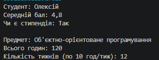

# Лабораторна робота №4: Властивості, індексатори та перевантаження операторів

**Студент:** Андрій Щур  
**Група:** КН 3/1  
**Варіант:** №10  

---

## Опис проєкту
Консольний проєкт на C#, що демонструє реалізацію класу `Percentage` з використанням інкапсуляції, валідації даних, статичних членів, індексаторів та перевантажених операторів.

---

## Структура та можливості класу

* **Приватне поле:** `_value` (`double`) — збереження значення відсотка.
* **Властивість:** `Value` — валідація значення в діапазоні `0..100` (викидає `ArgumentOutOfRangeException` при помилці).
* **Статичний член:** `MaxPercentage` — повертає об'єкт зі значенням `100%`.
* **Індексатор:** `this[int index]`:
  * `[0]` — значення відсотка;
  * `[1]` — залишок до `100%`.
* **Оператори:** `+`, `*` (комутативний), `==`, `!=`.
* **Перевизначені методи:** `ToString()`, `Equals()`, `GetHashCode()`.

---

## Хід роботи

1. **Ініціалізація проєкту:** створено консольний проєкт .NET (`dotnet new console`).
2. **Проєктування класу:** оголошено приватне поле `_value` та реалізовано властивість `Value` із перевіркою коректності даних.
3. **Реалізація індексатора та статичних членів:** додано індексатор `this[index]` та статичну властивість `MaxPercentage`.
4. **Перевантаження операторів:** перевантажено арифметичні оператори та оператори порівняння.
5. **Перевизначення методів `Object`:** налаштовано форматований вивід у `ToString()` та порівняння в `Equals()`.
6. **Тестування:** у `Program.cs` перевірено роботу класів та обробку винятків.

---

## Приклад


---

## Запуск проєкту

```bash
dotnet run

