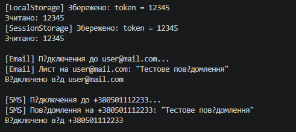

# Лабораторна робота №10: Абстрактні класи та інтерфейси. Контракти та реалізації

**Студент:** Андрій Щур
**Група:** КН 3/1
**Варіант:** №N 10

---

## Опис проєкту
Консольний проєкт lab10vN, що демонструє створення та використання інтерфейсу `IStorage` і абстрактного класу `MessageSender`, порівнюючи принципи роботи контрактів без реалізації та базових класів зі спільною поведінкою.

---

## Структура класів

* **IStorage (інтерфейс):**
  * Методи: `Save(string key, string value)`, `Load(string key)`.

* **LocalStorage & SessionStorage (реалізації інтерфейсу):**
  * Реалізують методи збереження та зчитування даних для файлової бази та оперативної пам'яті відповідно.

* **MessageSender (абстрактний клас):**
  * Властивість: `Destination`.
  * Методи: `Connect()` (abstract), `Send(string message)` (abstract), `Disconnect()` (конкретний метод).

* **EmailSender & SmsSender (похідні класи):**
  * Перевизначають методи `Connect()` та `Send()` для логіки відправки пошти та SMS, використовуючи спільний метод `Disconnect()`.

---

## Приклад
