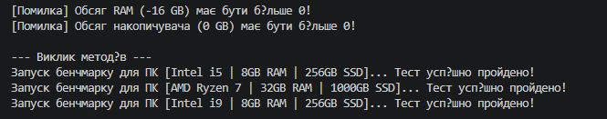

### README.md для Лабораторної роботи №2 (Варіант 10)

# Лабораторна робота №2. Перевантаження конструкторів та життєвий цикл об'єкта

**Студент:** Андрій Щур
**Група:** КН 3/1  
**Варіант:** №10 (Клас Computer)  

## Опис проєкту
У цій лабораторній роботі розширено клас `Computer` шляхом додавання перевантажених конструкторів, ланцюгового виклику через `: this()`, перевірки значень у властивостях (RAM та Storage не можуть бути <= 0) та деструктора.

У методі `Main` продемонстровано створення 3 об'єктів різними конструкторами, роботу валідації значень, а також роботу збирача сміття (`GC.Collect()`), який видаляє об'єкти з пам'яті.

## Як запустити проєкт
1. Клонувати репозиторій:
   ```bash
   git clone https://github.com/shchurkn31/OOP-Shchur/tree/main/lab2v10

---
## Приклад 
