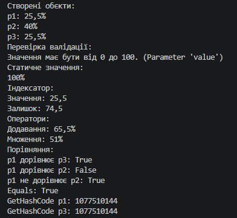

# Лабораторна робота №4. Властивості та статичні члени класу. Індексатори й перевантаження операторів.

**Студент:** Андрій Щур 
**Група:** КН 3/1 
**Варіант:** №10 (Клас ImageBuffer)  

---

# Основні можливості та структура класу
Клас Percentage реалізовано відповідно до вимог ООП і містить такі елементи:

Приватне поле: _value (тип double) — зберігає числове значення відсотка.

Публічна властивість із валідацією: Value — контролює, щоб значення відсотка перебувало в межах від 0 до 100. При спробі встановити значення поза цим діапазоном генерується виключення ArgumentOutOfRangeException.

Статичний член: MaxPercentage — статична властивість, що повертає готовий об'єкт зі значенням 100% (Percentage(100)).

Індексатор: this[int index] — надає доступ до даних за індексом:

[0] — повертає поточне значення відсотка;

[1] — повертає доповнення до 100% (залишок).

Перевантажені оператори:

+ — додавання двох відсотків;

* — множення відсотка на число (з підтримкою комутативності: p * num та num * p);

== та != — перевірка рівності та нерівності об'єктів за значенням.

Перевизначені методи:

ToString() — форматований вивід значення зі знаком %;

Equals() та GetHashCode() — порівняння об'єктів за вмістом з урахуванням похибки обчислень чисел із плаваючою крапкою.

---

# Приклад
