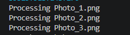

# Лабораторна робота №5. Індексатори та перевантаження операторів.

**Студент:** Андрій Щур 
**Група:** КН 3/1 
**Варіант:** №10 (Клас TimeTable)  

---

## Опис
Клас ImageBuffer реалізує IDisposable для звільнення керованих (масив) і некерованих (пам'ять IntPtr) ресурсів через метод Dispose(bool) та фіналізатор з підтримкою GC.SuppressFinalize().

Протестовані сценарії:

Блок using — автоматичне та миттєве очищення всіх ресурсів.

Виклик Dispose() — ручне звільнення із захистом від повторного виклику.

GC.Collect() — примусова фіналізація некерованої пам'яті, якщо Dispose() не було викликано.

## Висновок:
Використання using є найбезпечнішим способом роботи з ресурсами, а фіналізатор виконує роль страховки від витоків пам'яті.

---

## Як запустити проєкт

1. Клонувати репозиторій:
   ```bash
   git clone https://github.com/shchurkn31/OOP-Shchur/tree/main/lab5v10

---
## Приклад
