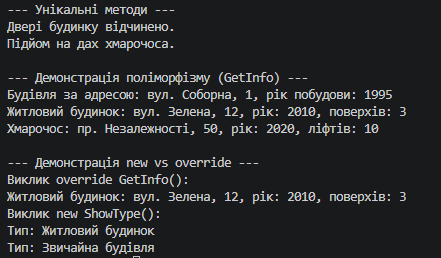

# Лабораторна робота №6: Наслідування та поліморфізм у C#

**Студент:** Андрій Щур  
**Група:** КН 3/1  
**Варіант:** №10  

---

## Опис проєкту
Консольний проєкт lab6v10, що демонструє побудову ієрархії класів (Building -> House, Skyscraper), використання ключових слів base, virtual, override для реалізації поліморфізму та використання модифікатора new для приховування членів базового класу.

---

## Структура класів

* **Building (базовий клас):**
  * Поля та властивості: Address, YearBuilt.
  * Метод GetInfo() (virtual) — повертає базову інформацію про будівлю.
  * Метод ShowType() — невіртуальний метод для демонстрації приховування.

* **House (похідний клас):**
  * Поля та властивості: NumFloors.
  * Метод GetInfo() (override) — перевизначений метод.
  * Метод OpenDoor() — унікальний метод класу.
  * Метод ShowType() (new) — приховує метод базового класу.

* **Skyscraper (похідний клас):**
  * Поля та властивості: NumElevators.
  * Метод GetInfo() (override) — перевизначений метод.
  * Метод GoToRoof() — унікальний метод класу.

---

## Приклад


---

## Запуск проєкту

```bash
dotnet run