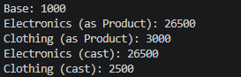

# Лабораторна робота №7: Перевизначення та приховування методів у C#

**Студент:** Андрій Щур  
**Група:** КН 3/1  
**Варіант:** №10  

---

## Опис проєкту
Консольний проєкт lab7v10, що демонструє різницю між перевизначенням методів через override та їх приховуванням за допомогою модифікатора new на прикладі ієрархії класів Product -> Electronics / Clothing.

---

## Структура класів

* **Product (базовий клас):**
  * Властивості: Name, BasePrice.
  * Метод GetPrice() (virtual) — повертає базову ціну.

* **Electronics (похідний клас):**
  * Властивість: WarrantyFee.
  * Метод GetPrice() (override) — перевизначає метод базового класу, додаючи вартість гарантії до базової ціни.

* **Clothing (похідний клас):**
  * Властивість: Discount.
  * Метод GetPrice() (new) — приховує метод базового класу, враховуючи знижку.

---

## Прикалд


---

## Запуск проєкту

```bash
dotnet run