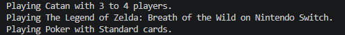

# Лабораторна робота №8: Поліморфізм, віртуальні методи та агрегація в C#

**Студент:** Андрій Щур
**Група:** КН 3/1
**Варіант:** №N 10

---

## Опис проєкту
Консольний проєкт lab8vN, що демонструє використання механізму поліморфізму, віртуальних методів через override, динамічне зв'язування та агрегацію результатів на прикладі ієрархії класів Game -> BoardGame / VideoGame / CardGame.

---

## Структура класів

* **Game (базовий клас):**
  * Властивість: Title.
  * Метод Play() (virtual) — базова реалізація запуску гри.

* **BoardGame (похідний клас):**
  * Властивості: MinPlayers, MaxPlayers.
  * Метод Play() (override) — перевизначає метод базового класу, виводячи інформацію про настільну гру та кількість гравців.

* **VideoGame (похідний клас):**
  * Властивість: Platform.
  * Метод Play() (override) — перевизначає метод базового класу, виводячи інформацію про відеогру та ігрову платформу.

* **CardGame (похідний клас):**
  * Властивість: NumDecks.
  * Метод Play() (override) — перевизначає метод базового класу, виводячи інформацію про карткову гру та кількість колод.

---

## Приклад
