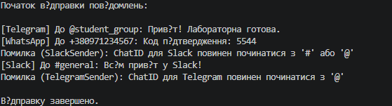

# Лабораторна робота №9: Поліморфні сервіси

**Студент:** Андрій Щур
**Група:** КН 3/1
**Варіант:** №N 10

---

## Опис проєкту
Консольний проєкт lab9vN, що демонструє використання механізму поліморфізму, абстрактних методів, обробки винятків через `try-catch` та роботи зі списками базового типу на прикладі ієрархії класів `MessageSender` -> `TelegramSender` / `WhatsAppSender` / `SlackSender`.

---

## Структура класів

* **MessageSender (базовий абстрактний клас):**
  * Властивості: `ChatId`, `Message`.
  * Метод `SendMessage(string chatId, string message)` (abstract) — визначає контракт для відправки повідомлень.

* **TelegramSender (похідний клас):**
  * Властивість: `IsChannel`.
  * Метод `SendMessage()` (override) — перевіряє, чи починається `chatId` з `@`, і виводить повідомлення у консоль.

* **WhatsAppSender (похідний клас):**
  * Властивість: `IsBusiness`.
  * Метод `SendMessage()` (override) — перевіряє, чи починається номер з `+`, і виводить повідомлення у консоль.

* **SlackSender (похідний клас):**
  * Властивість: `Workspace`.
  * Метод `SendMessage()` (override) — перевіряє, чи починається `chatId` з `#` або `@`, і виводить повідомлення у консоль.

* **NotificationService (сервісний клас):**
  * Метод `SendAll(List<MessageSender> items)` — перебирає список об'єктів базового типу, викликає метод `SendMessage` для кожного та обробляє помилки за допомогою `try-catch`.

---

## Приклад
